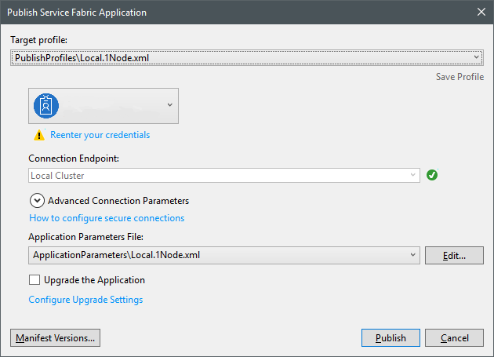
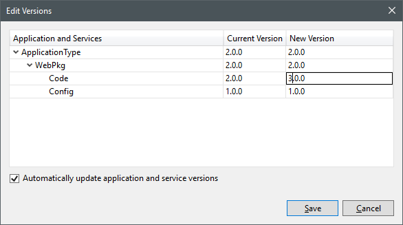

# Creating the Order application
The Orders application is a **Stateful Service** that implements a pair of lightweight WebAPI controllers. These
controllers use `IReliableStateManager` to persist and query data from `IReliableQueue` and `IReliableDictionary`
implementations.

Once an order has been placed on the `IReliableQueue` then it will be dequeued and processed by the `OrdersService`
and then have the data persisted to MongoDB. Once the data in MongoDB has been written then the `Statistics` data 
will be written to the `IReliableDictionary`.

## Get the code
Execute the following command in the root directory of this repository:

```
git checkout orders
```

## Review the Appication
There are three parts to this service, the two controllers `OrdersController` and `StatisticsController`, and
the `OrdersService` **Stateful Service** that processes orders and persists them to MongoDB.

### Edit Program.cs

```csharp
ServiceRuntime.RegisterServiceAsync("OrdersApiType", context =>
{
    if (repository == null)
    {
        lock (sync)
        {
            if (repository == null)
            {
                BsonSerializer.RegisterSerializer(typeof(decimal), new DecimalSerializer(BsonType.Decimal128));
                BsonSerializer.RegisterSerializer(typeof(decimal?), new NullableSerializer<decimal>(new DecimalSerializer(BsonType.Decimal128)));
                repository = new OrdersRepository(context);
            }
        }
    }

    return new OrdersApi(context, repository);
}).GetAwaiter().GetResult();
```

### Edit OrdersApi.cs

```csharp
return new WebHostBuilder()
    .UseKestrel()
    .ConfigureServices(
        services => services
            .AddSingleton(serviceContext)
            .AddSingleton(StateManager)
            .AddSingleton(repository))
    .UseContentRoot(Directory.GetCurrentDirectory())
    .UseStartup<Startup>()
    .UseServiceFabricIntegration(listener, ServiceFabricIntegrationOptions.UseUniqueServiceUrl | ServiceFabricIntegrationOptions.UseReverseProxyIntegration)
    .UseUrls(url)
    .Build();
```

```csharp
protected override async Task RunAsync(CancellationToken cancellationToken)
{
    var queue = await StateManager.GetOrAddAsync<IReliableConcurrentQueue<Order>>(StateName);
    var statistics = await StateManager.GetOrAddAsync<IReliableDictionary2<string, string>>(StatisticsName);

    while (true)
    {
        cancellationToken.ThrowIfCancellationRequested();

        using (var tx = StateManager.CreateTransaction())
        {
            var result = await queue.TryDequeueAsync(tx, cancellationToken);
            if (result.HasValue)
            {
                var currentStatistics = await repository.AddOrderAsync(result.Value, cancellationToken);
                if (currentStatistics != null)
                {
                    var json = JsonConvert.SerializeObject(currentStatistics);
                    await statistics.AddOrUpdateAsync(tx, $"{result.Value.OrderDateTime:yyyyMMdd}", json, (id, stats) => json);
                }

                await tx.CommitAsync();
            }
            else
            {
                await Task.Delay(TimeSpan.FromSeconds(1), cancellationToken);
            }
        }
    }
}
```

### Edit OrdersController.cs

```csharp
[HttpPost]
public async Task<ActionResult> Post([FromBody] Order order)
{
    try
    {
        var state = await stateManager.GetOrAddAsync<IReliableConcurrentQueue<Order>>(StateName);

        using (var tx = stateManager.CreateTransaction())
        {
            await state.EnqueueAsync(tx, order);
            await tx.CommitAsync();
            return Ok();
        }
    }
    catch (Exception e)
    {
        var response = Json(new
        {
            e.Message
        });
        response.StatusCode = 500;
        return response;
    }
}
```

### Edit StatisticsController.cs

```csharp
[HttpGet("{id}")]
public async Task<ActionResult<IEnumerable<Statistics>>> Get(string id)
{
    try
    {
        var statistics = await stateManager.TryGetAsync<IReliableDictionary2<string, string>>(StatisticsName);
        if (!statistics.HasValue)
        {
            return NotFound();
        }

        using (var tx = stateManager.CreateTransaction())
        {
            var value = await statistics.Value.TryGetValueAsync(tx, id);
            if (!value.HasValue)
            {
                return NotFound();
            }

            var stats = JsonConvert.DeserializeObject<IEnumerable<Statistics>>(value.Value);
            return Ok(stats);
        }
    }
    catch (Exception e)
    {
        var response = Json(new
        {
            e.Message
        });
        response.StatusCode = 500;
        return response;
    }
}
```

# Deploying the Service
If you are running Visual Studio then the service can be deployed to a local Service Fabric cluster by right 
clicking the Service Fabric Application in Solution Explorer and choosing the Publish option. This will open 
a dialog that allows the cluster to be selected. By default this will be an Azure cluster but there are also
options for Single and Five Node clusters.



Choose the option that matches your local Service Fabric cluster setup and click Publish. The output will be 
displayed in the Output Window in Visual Studio.

# Updating the Web Application
The ASP.NET MVC application from [Lab 3](Lab3_WebApplication.md) will also be updated to support ordering the 
items currently in the basket and displaying statistics about previous orders.

## Review Service
The Application service is an MVC application that provides controllers which access the microservices. In order
to support Orders, the existing `BasketController` will be updated to provide a means of submitting the order
and then clearing the local basket ID cookie.

In addition to allowing orders to be placed this service will also be extended to provide statistical data from
the orders which have been placed.

### Editing BasketController.cs

```csharp
[HttpPost]
[ValidateAntiForgeryToken]
public async Task<IActionResult> Order(string redirect)
{
    using (var response = await http.GetAsync(await GetServiceUriAsync("Basket", "BasketApi", $"/api/basket/{GetBasketId()}")))
    {
        var order = new Order
        {
            Id = new Guid(GetBasketId()),
            OrderDateTime = DateTimeOffset.Now,
            Products = await DeserializeResponseAsync<Product[]>(response)
        };

        using (var content = GetJsonContent(order))
        using (await http.PostAsync(await GetServiceUriAsync("Orders", "OrdersApi", $"/api/orders", () => new ServicePartitionKey(1)), content))
        using (await http.DeleteAsync(await GetServiceUriAsync("Basket", "BasketApi", $"/api/basket/{GetBasketId()}")))
        {
            ClearBasketId();
        }

        return !string.IsNullOrEmpty(redirect) ?
                (IActionResult)Redirect(redirect) :
                RedirectToAction("Index");
    }
}
```

## Deploying the update
It is necessary to update the `CodePackage` version for the service in order to carry out an update. This follows
the same process as a typical deployment. The `Manifest Versions` button can be clicked to view the updated code
version, which should appear as follows:



Set the `New Version` for the `Code` package to be `3.0.0` and ensure that the checkbox to update the application 
and service versions is ticked. Once the versions have been updated then click `Save` and then `Publish` to deploy
the updated application.

# Testing the Service

When the Orders application has been deployed and Application has been updated then the new basket functionality can be
tested. This can either be via the Swagger UI, going directly to the Orders API or orders can be made through the UI.

The Swagger endpoint for the Basket API is [http://localhost:19081/Orders/OrdersApi/swagger](http://localhost:19081/Orders/OrdersApi/swagger)

The UI is accessible through [http://localhost](http://localhost) and a link on the updated home page.