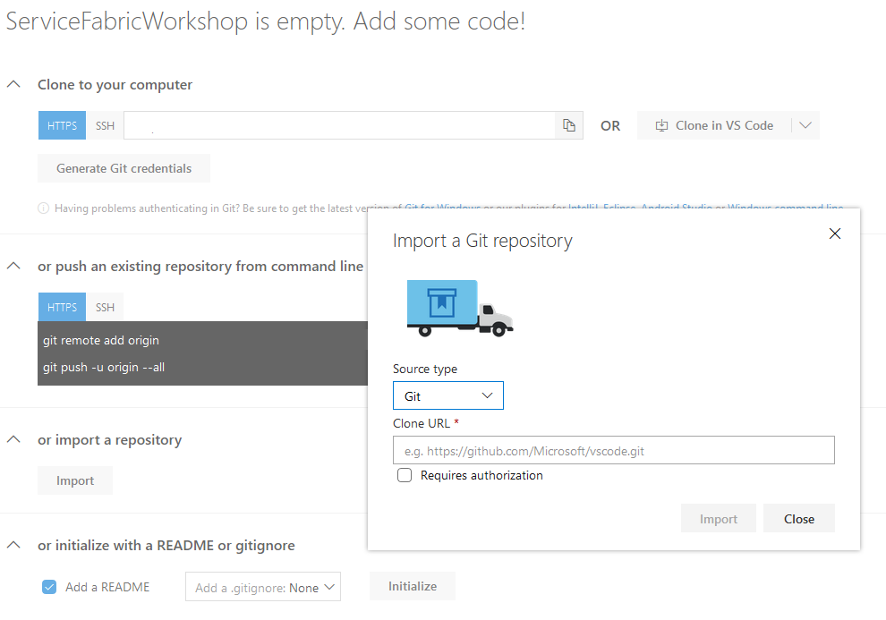
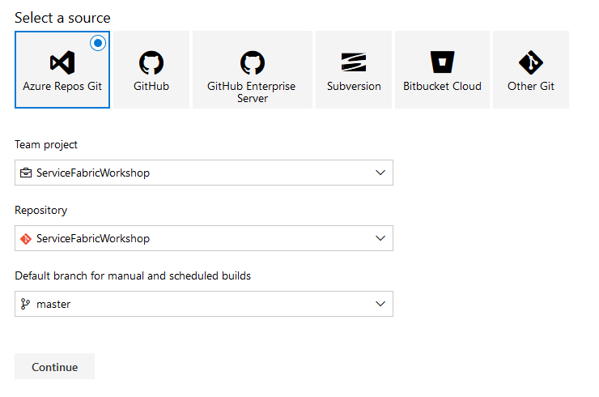
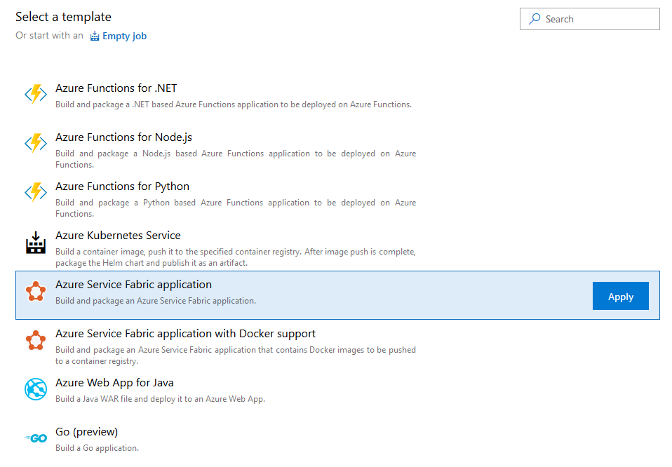
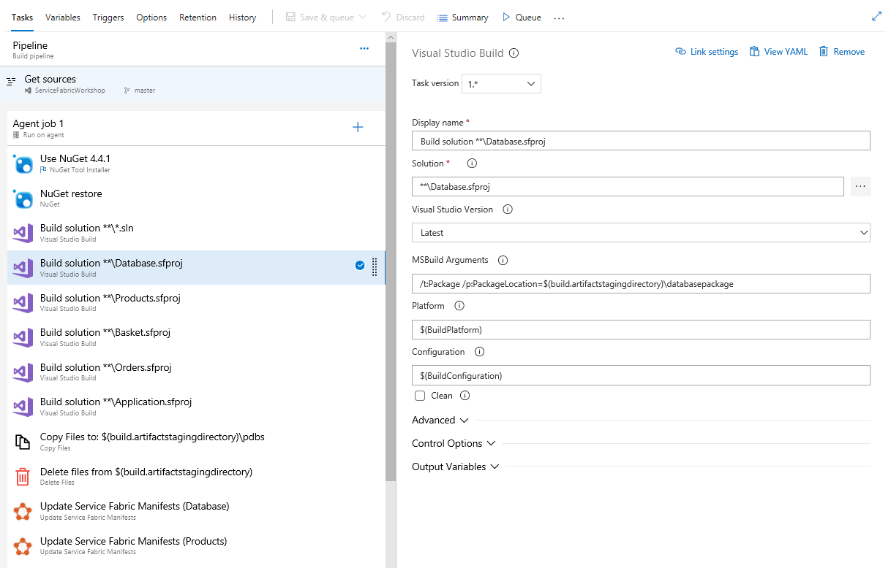
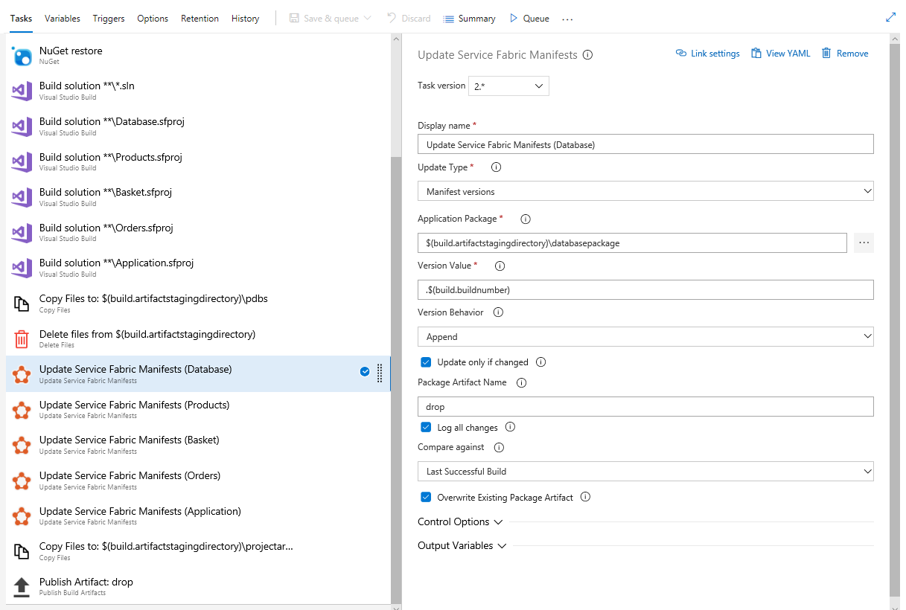
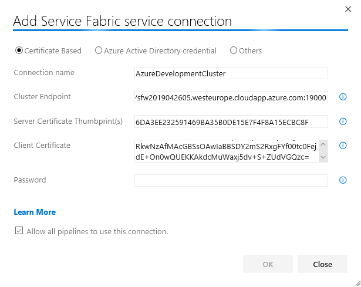
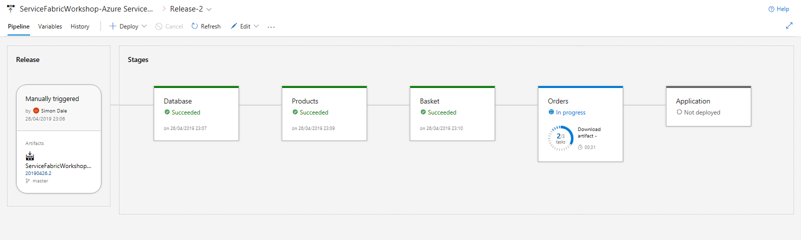
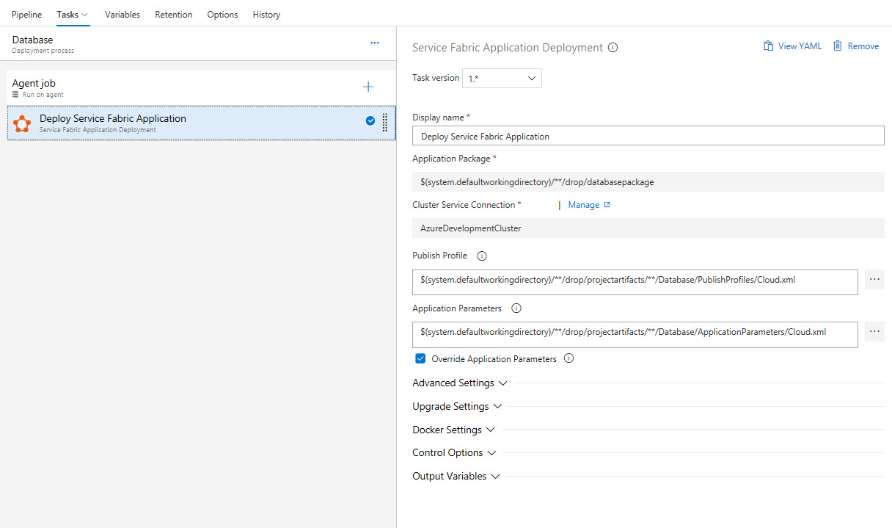
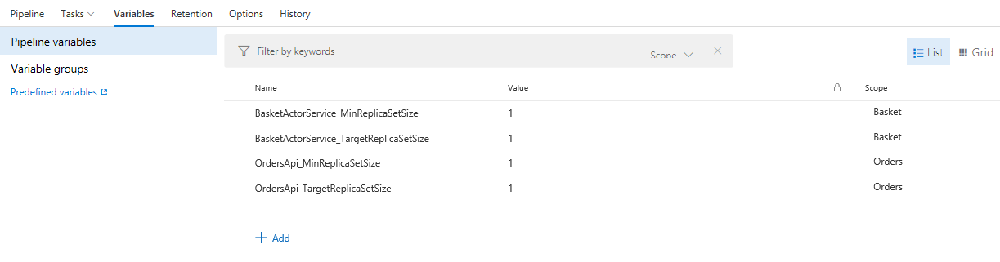
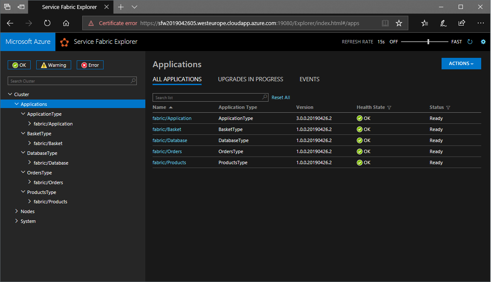

# Configuring Azure DevOps Pipelines
To setup Azure DevOps Pipelines you will need an [account](https://dev.azure.com) with a git repository.
Once this has been created you can import the code from this [repository](https://github.com/simondale/service-fabric-workshop) 
as shown in the image below:

## Build Pipeline
When the code has imported the next step is to create a **Build Pipeline**. 

The first step is to select the source code for the build as shown below:

Here we are selecting the Azure DevOps repository we previously imported and we are selecting the default branch to build.

The next step is to start building out the pipeline and for this we can use a template for **Azure Service Fabric application**.

This repository contains 5 separate Service Fabric applications so some customisation of the pipeline is required in order to 
create a build artifact that contains the necessary Service Fabric packages.

This is done by adding new **Visual Studio Build** templates to the build and targetting specific `.sfproj` files:

There is a further step later in the pipeline where the manifest version numbers are automatically updated which again requires
a task for each application:

Once the build has been configured then it can be saved and triggered.

## Release Pipeline
The release pipeline is where the Service Fabric packages from the previous step are deployed to the cluster created in 
[Lab 6](Lab6_AzureCluster.md). This requires a connection to the Service Fabric Cluster to be created and this utilises the
settings obtained during the previous lab.

Once a connection is defined this can be used in the various different stages of the pipeline.

The target is to build a pipeline that resembles the following:

But, rather than create each of the tasks individually it is more efficient to setup the first **Database** stage and then clone this
stage a number of times and editing the settings along the way.

The **Database** stage should be similar to the following screenshot:

The settings that vary for each stage are:
* Application Package (specified on the *Deployment process* panel)
* Publish Profile
* Application Parameters

It is important to ensure that **Override Application Parameters** is set too as this allows settings in the file to be overriden
using Release Variables. All of the checkboxes beneath **Upgrade Settings** should also be set to enable upgrades and delta deployments.

Once all of the stages in the pipeline have been configured some release variables may need to be set, depending upon the size of the 
Service Fabric cluster. By default, the expectation is that there will be 5 nodes. If a development/test cluster is being used and this has
fewer nodes then **Release Variables** can be set to reduce the min/max number of replicas, as shown below:

When all of these settings have been made the release can be saved and triggered. This should deploy the applications to the cluster.

If everything has worked you should see the following:

