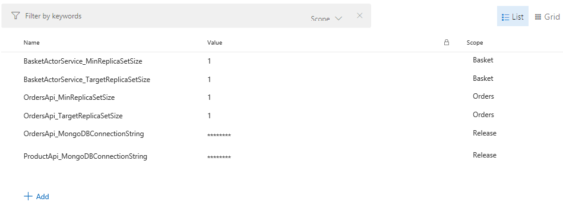

# Optional: Swap-out MongoDB with CosmosDB
Now that the application is running in Azure there is no need for the MongoDB guest executable
and a more robust solution can be used instead.

The simplest way to configure this is to create a CosmosDB database with the following command:

```bash
az cosmosdb create \
    --name $CLUSTER_NAME \
    --resource-group $RESOURCE_GROUP \
    --kind MongoDB
```

Once created we will need to query the MongoDB connection string:

```bash
az cosmosdb list-connection-strings \
    --resource-group $RESOURCE_GROUP \
    --name $CLUSTER_NAME \
    --query "connectionStrings[?description==\`Primary MongoDB Connection String\`].connectionString|[0]" | sed -e 's/\"//g'
```

## Overriding Configuration

The **Products** and **Orders** applications will then need to be updated so that **Release Variables**
can be used to override the connection string. This is done by editing the `ApplicationManifest.xml` file:

### Products Application

Edit the `ApplicationManifest.xml` file to include the following settings:

```XML
<Parameter Name="ProductApi_MongoDBConnectionString" DefaultValue="mongodb://{application:service}" />
```

```XML
<ConfigOverrides>
    <ConfigOverride Name="Config">
    <Settings>
        <Section Name="Database">
        <Parameter Name="ConnectionString" Value="[ProductApi_MongoDBConnectionString]" />
        </Section>
    </Settings>
    </ConfigOverride>
</ConfigOverrides>
```

Also edit the three **ApplicationParameter** files `Cloud.xml`, `Local.1Node.xml` and `Local.5Node.xml`
to include the parameter so **Release Variables** can be used as overrides:

```XML
<Parameter Name="ProductApi_MongoDBConnectionString" Value="mongodb://{application:service}" />
```

### Orders Application

Edit the `ApplicationManifest.xml` file to include the following settings:

```XML
<Parameter Name="OrdersApi_MongoDBConnectionString" DefaultValue="mongodb://{application:service}" />
```

```XML
<ConfigOverrides>
    <ConfigOverride Name="Config">
    <Settings>
        <Section Name="Database">
        <Parameter Name="ConnectionString" Value="[OrdersApi_MongoDBConnectionString]" />
        </Section>
    </Settings>
    </ConfigOverride>
</ConfigOverrides>
```

Also edit the three **ApplicationParameter** files `Cloud.xml`, `Local.1Node.xml` and `Local.5Node.xml`
to include the parameter so **Release Variables** can be used as overrides:

```XML
<Parameter Name="ProductApi_MongoDBConnectionString" Value="mongodb://{application:service}" />
```

## Release Variables

This can then be set in the Release Variables section of the Release Pipeline. The variables should now 
contain the following settings:



**When specifying sensitive data for Release Variables ensure that masking is enabled**